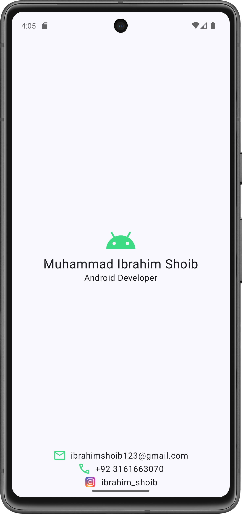

# Business-Card-App

<h3>This basic app makes use of elementary concepts of app development, that are:</h3>
1. Row, Column, and Box composables 
2. Text composables 
3. Modifiers and alignment 
4. Images and Icons 

<h3>Built with:</h3>
* Kotlin 
* Jetpack Compose

<h3>Contact:</h3>
Muhammad Ibrahim Shoib 
Email: ibrahimshoib123@gmail.com 
Project Link: https://github.com/ibrahimshoib/Business-Card-App 

<h3>Acknowledgements:</h3>
* https://developer.android.com/courses/android-basics-compose/course 
* https://fonts.google.com/icons 
